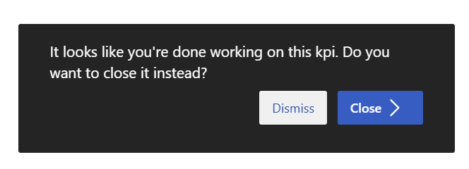

# Vega Platform Backlog

**Last Updated:** December 18, 2025

---

## EXECUTIVE SUMMARY & PRIORITY SEQUENCE

### Current Status Assessment (December 10, 2025)

| Item | Backlog Status | Actual Status | Notes |
|------|----------------|---------------|-------|
| **1. RBAC** | ~95% | ✅ 95% | Core security complete. Fine-grained permissions remaining. |
| **2. M365 Multi-Tenant** | ~60% | ~65% | SSO, Planner, SharePoint/OneDrive working. Admin consent, Calendar sync remaining. |
| **3. Focus Rhythm** | ~70% | ✅ ~85% | Decisions/Risks UI complete. OKR linking complete. Meeting templates complete. |
| **4. Culture & Values** | Complete | ✅ Complete | |
| **5. M365 Copilot Agent** | Not Started | Not Started | **January deadline - CLIENT REQUIREMENT** |
| **6. AI-Powered Assistance** | Not Started | ~40% | 7 AI tools implemented. Q&A chat with function calling works. |
| **6a. AI Usage Reporting** | Schema Complete | ✅ Schema Complete | Dec 17, 2025 - API & UI remaining |
| **6b. Azure OpenAI Migration** | Backlogged | Backlogged | **NEW** - Future infrastructure decision |
| **7. Enhanced Reporting** | Not Started | ~10% | Basic review_snapshots table exists. No PDF/export. |
| **8. Export/Import** | Complete | ✅ Complete | |
| **9. Customizable Branding** | Schema Complete | Schema Complete | Dec 18, 2025 - UI remaining |
| **17. AI Kickstart Wizard** | Not Started | Not Started | **NEW** - Document-to-CompanyOS AI generator |
| **10. Governance & Audit** | Not Started | Not Started | Schema change required |
| **10c. KR Weighting** | Not Started | ✅ Complete | WeightManager UI complete. |
| **10a. Check-in Close Prompt** | Not Started | ✅ Complete | Dec 16, 2025 |
| **Custom Vocabulary** | Complete | ✅ Complete | VocabularyContext + system/tenant overrides |
| **Team Mode** | Complete | ✅ Complete | /team route with filtered views |
| **Objective Alignment** | Complete | ✅ Complete | alignedToObjectiveIds many-to-many |
| **16. Team Management** | Not Started | Not Started | **NEW** - CRUD UI, M365 Groups import |

### Recommended Priority Sequence (Next 8 Weeks)

```
PHASE 1: Schema Changes First (Weeks 1-2, Dec 16 - Dec 27)
├── AI Usage Reporting Schema (1 day) ✅ COMPLETE (Dec 17)
│   ├── ai_usage_logs table with provider/model tracking
│   └── ai_usage_summaries table for aggregations
├── Enhanced Reporting & Snapshots Schema (1-2 days)
│   ├── Expand review_snapshots table
│   ├── Add snapshot configuration fields to tenants
│   └── Add report templates table
├── Customizable Branding Schema (1 day)
│   ├── Add branding fields to tenants table
│   └── Add report templates with branding
└── Governance & Audit Schema (1-2 days)
    ├── Add audit_logs table
    └── Add access control fields

PHASE 2: M365 Copilot Agent (Weeks 2-5, Dec 23 - Jan 17)
├── OpenAPI spec for Vega endpoints
├── Declarative agent manifest + instructions
├── Testing in M365 dev tenant
└── Client deployment + refinement

PHASE 3: M365 Completion (Weeks 3-5)
├── Fix Production SSO Session Bug (1-2 days)
├── Admin Consent Endpoint (3-4 days)
└── Outlook Calendar Sync (1 week)

PHASE 4: Feature Implementation (Weeks 5-8, Jan 13 - Feb 7)
├── AI Usage Reporting UI & API
├── Enhanced Reporting UI
├── Customizable Branding UI
└── OKR Cloning
```

### Blocking Issues

1. **Production SSO Session Bug** - Blocks enterprise deployment
2. **No OpenAPI Spec** - Blocks M365 Copilot Agent
3. **Admin Consent Endpoint Missing** - Blocks enterprise M365 onboarding

### Quick Wins Available Now

1. **KR Weighting UI** - Schema already has `weight` and `isWeightLocked` fields ✅ COMPLETE
2. **Focus Rhythm Decisions/Risks** - Schema already has `decisions` and `risks` JSONB fields ✅ COMPLETE
3. **Check-in Close Prompt** - Simple UI enhancement ✅ COMPLETE (Dec 16, 2025)

### 🎯 Junior Developer Quick Wins (Recommended Next 3)

These tasks are ideal for junior developers - well-scoped, low-risk, and provide immediate value:

#### QW-1: Remove Temporary Logging Code 🧹 ✅ COMPLETE
**Effort:** 30 minutes | **Risk:** None | **Files:** 2-3 | **Completed:** Dec 17, 2025

~~Remove debug `console.log` statements added during development:~~
- ~~`client/src/pages/PlanningEnhanced.tsx` - Line ~1330: Big Rock submit logging~~
- ~~`server/routes-okr.ts` - Lines ~231-236: Big Rock update logging~~

**Note:** `server/viva-goals-importer.ts` retains [DEBUG] logging intentionally for import troubleshooting.

#### QW-2: Objective Progress Overview UX Polish 🎨 ✅ COMPLETE
**Effort:** 2-4 hours | **Risk:** Low | **Files:** 1-2 | **Completed:** Dec 17, 2025

~~Improve the objective progress display on the Company OS Dashboard:~~
- ~~Sort objectives by level (org first), then by lowest progress to highlight issues~~
- ~~Status-colored progress bars: Green (≥70%), Yellow (40-69%), Red (<40%)~~
- ~~Cap display at 100% with "Exceeds Target" badge for >100%~~
- ~~Add status icons for quick scanning (checkmark, warning, alert)~~

**Implementation:**
- `PlanningEnhanced.tsx` ProgressDashboard component enhanced with:
  - Sorting by level (organization > team > individual), then by lowest progress
  - Color-coded progress bars (green ≥70%, yellow 40-69%, red <40%)
  - "Exceeds Target" badge for objectives with >100% progress
  - Status icons (CheckCircle, AlertTriangle, AlertCircle) for quick scanning
  - Updated summary cards to show "On Track", "Behind", "At Risk" counts with clear percentage thresholds

#### QW-3: Hide Admin Features from Regular Users 👁️ ✅ COMPLETE
**Effort:** 2-3 hours | **Risk:** Low | **Files:** 3-5 | **Completed:** Dec 17, 2025

~~Add role-based UI restrictions to hide admin-only features:~~
- ~~Use existing `useUser()` hook to check `user.role`~~
- ~~Hide "Tenant Admin" menu item for non-admins~~
- ~~Hide "Delete" buttons on meetings for non-admins~~
- ~~Conditionally render admin sections in settings~~

**Implementation:**
- `AppSidebar.tsx`: Uses `hasPermission()` from `shared/rbac.ts` to conditionally show Import Data, AI Grounding, Tenant Admin, and System Admin menu items based on user permissions
- `FocusRhythm.tsx`: Delete meeting button only visible to users with `DELETE_MEETING` permission

---

## KNOWN ISSUES & BUGS 🐛

### Production SSO Session Persistence Bug ⚠️ ACTIVE

**Status:** Under Investigation  
**Severity:** High

**Issue:**
When users log in via Microsoft SSO at the Replit URL (`vega-prototype-chrismcnulty1.replit.app`), the session cookie is not persisting after redirect. Users complete SSO successfully but are redirected back to the login screen instead of the dashboard.

**Confirmed:**
- `AZURE_BASE_URL` is correctly set to `https://vega-prototype-chrismcnulty1.replit.app`
- SSO callback is reached and session is created (`req.session.save()` is called)
- User is accessing from the same domain (Replit URL, not custom domain)

**Suspected Causes:**
1. Cookie settings (`sameSite`, `secure`, `domain`) may not work correctly behind Replit's reverse proxy
2. Session save timing issue before redirect
3. Cross-origin redirect behavior from `login.microsoftonline.com`

**Next Steps:**
1. Add logging to verify session ID before and after redirect
2. Check if `trust proxy` setting is working correctly
3. Test with explicit cookie domain setting
4. Verify session table entries are being created

---

### Microsoft Planner Integration Issues

**Status:** Partially Working  
**Severity:** Medium

**Current Issues:**
1. **Token Dependency on Outlook:** Planner integration requires Outlook connection first. If a user hasn't connected Outlook, Planner auth may fail silently.
2. **Scope Limitations:** `Tasks.Read` permission provides read-only access. Task creation/updates require `Tasks.ReadWrite` which isn't currently requested.
3. **Rate Limiting:** Planner has restrictive throttling (100 req/10 sec). Bulk operations may fail under load.
4. **Sync Status Tracking:** `lastSyncAt` is tracked but no automatic sync scheduler exists - requires manual refresh.
5. **Error Handling:** Some Planner API errors (especially permission-related) may not surface user-friendly messages.

**Workarounds:**
- Ensure Outlook is connected before attempting Planner connection
- Manual refresh for task updates
- Check Settings page for connection status

---

### Microsoft SharePoint Integration Issues

**Status:** Partially Working  
**Severity:** Medium

**Current Issues:**
1. **Sites.Selected Permission Limitation:** Cannot list all SharePoint sites with current permissions. Uses fallback methods (followed sites, root site, wildcard search) which may miss some sites.
2. **Sites.Read.All Required for Search:** Wildcard site search only works with broader permissions that customers may be hesitant to grant.
3. **URL Resolution Issues:** `getSharePointSiteFromUrl` may fail on certain URL formats or when user lacks access to the resolved site.
4. **Drive Discovery:** `/me/drives` endpoint may not surface all SharePoint document libraries, especially those the user hasn't recently accessed.
5. **Access Denied Handling:** Some permission errors from Shares API return generic errors instead of actionable guidance.

**Workarounds:**
- Use direct SharePoint URLs when possible
- Ensure admin consent for SharePoint scopes
- Follow sites in SharePoint to make them discoverable

---

### Database Schema Issues (Production)

**Status:** Resolved (with fallbacks)  
**Severity:** Low

**Recent Fix (Dec 9):**
- Added try-catch fallbacks for `import_history` table queries
- App gracefully handles missing tables in production until schema is pushed
- Schema push needed on production for full import history functionality

---

### Progress Calculation Bug (FIXED)

**Status:** ✅ Resolved (Dec 9)  
**Issue:** Progress was incorrectly capped at 100% maximum
**Fix:** Removed 0-100% clamping - now correctly displays >100% achievement

---

## HIGH PRIORITY (Business-Critical)

### 1. RBAC Enforcement ✅ CORE SECURITY FIXED

**Status:** Auth + Tenant Isolation Complete, Fine-Grained Permissions Remaining  
**Priority:** High (was Critical)  
**Effort:** 1 week remaining (reduced scope)

**Description:**
Role-Based Access Control infrastructure is complete. All routes now require authentication and tenant isolation.

**What's Built (✅ Complete):**
- 6 roles defined in `shared/rbac.ts`: `tenant_user`, `tenant_admin`, `admin`, `global_admin`, `vega_consultant`, `vega_admin`
- 20+ permissions defined (CREATE_OKR, UPDATE_ANY_OKR, MANAGE_TENANT_USERS, etc.)
- Permission matrix in `shared/rbac.ts` mapping roles → permissions
- RBAC middleware in `server/middleware/rbac.ts`:
  - `requireRole()` - role-based access
  - `requirePermission()` - permission-based access
  - `requireTenantAccess()` - tenant isolation
  - Pre-configured: `rbac.tenantAdmin`, `rbac.platformAdmin`, `rbac.anyUser`

**All Routes NOW Protected (Dec 9, 2025):**
- ✅ **OKR routes** (`/api/okr/*`): `authWithTenant` middleware applied
- ✅ Tenant CRUD: `adminOnly` or `platformAdminOnly`
- ✅ User CRUD: `adminOnly`
- ✅ Foundations: `adminOnly` for write, `authWithTenant` for read
- ✅ Strategies: `adminOnly` for write
- ✅ Meetings: `adminOnly` for delete
- ✅ Import routes: Internal session checks
- ✅ AI routes: Internal `requireAuth` per route
- ✅ Planner routes: Internal `requireAuth` + `requireTenantAccess`
- ✅ M365 routes: `requireAuth` + `loadCurrentUser`

**Remaining Work (Enhancement, not security-critical):**
1. Apply permission-based checks (UPDATE_ANY_OKR vs UPDATE_OWN_OKR)
2. Add ownership validation (users edit own OKRs unless admin)
3. UI restrictions based on role (hide admin features from regular users)

**Future Considerations:**
- **Team Membership (TBD):** Teams may optionally have limited membership, restricting which users can view/edit team-level objectives. This decision is pending and may affect how team-based access control is implemented.

**Business Value:** Essential for production deployment, compliance, and security.

**Dependencies:** None

---

### 2. Microsoft 365 Multi-Tenant Integration ⭐ ~60% COMPLETE

**Status:** Phase 1 Mostly Complete, Phases 2-3 Remaining  
**Priority:** High  
**Effort:** 4-6 weeks remaining (was 8-12 weeks)

**Description:**
Enterprise-grade Microsoft 365 integration using multi-tenant OAuth with single-click admin consent. Synozur registers ONE app in Azure AD configured as multi-tenant. Customer admins click "Connect to Microsoft 365" → review permissions → accept. Done. No Azure AD portal access, no keys, no certificates required from customers.

**What's Built (✅ Complete):**
- Multi-tenant MSAL config with `/common` authority (`routes-entra.ts`)
- Microsoft Entra ID login/callback flow
- JIT (just-in-time) user provisioning from SSO
- Tenant mapping via `azureTenantId` or email domain
- SSO policy enforcement (client + server side): `enforceSso`, `allowLocalAuth`
- User-friendly error handling for SSO failures
- Planner Integration (partial): OAuth consent, database tables, token encryption
- OneDrive/SharePoint file picker and drive enumeration

**⚠️ Known Issues:**
- **Production SSO Session Bug:** Login succeeds but session cookie doesn't persist after redirect (under investigation)
- Planner requires Outlook connection first
- SharePoint Sites.Selected permission limitations

**Remaining Work (Phases 2-3):**
1. Fix production SSO session persistence bug
2. Admin consent endpoint (`/common/adminconsent`)
3. Excel data binding for Key Results
4. Outlook Calendar sync for Focus Rhythm meetings
5. Incremental consent for Mail.Send
6. Custom app registration support for high-security tenants

---

#### Microsoft Graph Permission Scope (Refined)

| Service | Access Level | Permission | Vega Use Cases |
|---------|--------------|------------|----------------|
| **Outlook Calendar** | Read/Write | `Calendars.ReadWrite` | Meeting sync, Focus Rhythm scheduling |
| **Outlook Mail** | Write only | `Mail.Send` | Send meeting summaries, OKR alerts (no inbox reading) |
| **SharePoint** | Read only | `Sites.Read.All` | Pull strategy docs, governance files, shared resources |
| **OneDrive** | Read only | `Files.Read.All` | Import Excel files, attachments |
| **Microsoft Lists** | Read only | `Sites.Read.All` (same) | Mirror data into Vega, no write-back |
| **Planner** | Read only | `Tasks.Read` | View initiative status, no task creation |
| **Excel** | Read only | `Files.Read.All` (same) | Viva Goals import, workbook reads |

**Design Principle:** Read-only access wherever possible to minimize consent scope and security risk. Vega is the system of record; M365 provides context and inputs.

---

#### Phase 1: SSO Foundation (4-6 weeks)
- Multi-tenant app registration in Synozur Entra tenant
- `/api/auth/microsoft` callback route implementation
- Auto-provision trial tenants for new domains
- Add `authProvider`, `entraObjectId`, `entraRefreshToken` fields to user schema
- "Sign in with Microsoft" button in login UI
- Dual authentication support (email/password + SSO)

#### Phase 2: Graph API Integration (6-8 weeks)
- Admin consent endpoint (`/common/adminconsent`) integration
- Delegated permissions flow with MSAL
- Encrypted token storage system (AES-256) per tenant
- Graph API client service with tenant isolation
- "Connect Microsoft 365" UI in Tenant Admin settings
- Connection status display and disconnect option
- OKR import from Excel files (read-only)
- Planner status sync for Big Rocks (read-only)
- SharePoint document library browsing (read-only)

#### Phase 3: Enterprise Features (4 weeks)
- Custom app registration support for high-security tenants
- Tenant-specific app registration storage (optional override)
- Incremental consent for optional features (Mail.Send)
- Enterprise onboarding documentation

---

**Business Value:**
- Single-click consent for customer admins (no Azure AD expertise needed)
- Reduces friction for Microsoft 365 customers (90%+ of enterprise market)
- Enables seamless Excel/Planner/SharePoint data sync
- Read-only access minimizes security concerns and approval friction
- Enterprise-ready authentication
- Supports self-service and enterprise deployment models

**Technical Notes:**
- See `TECHNICAL_DECISIONS.md` for full architecture (ADR pending)
- Requires encrypted refresh token storage (AES-256)
- Multi-tenant app works for any Microsoft user globally
- No customer setup required for basic SSO
- Admin consent required for SharePoint, Lists, Planner scopes
- Throttling limits: Planner most restrictive (100 req/10 sec)

**Dependencies:**
- Environment variables: `MICROSOFT_CLIENT_ID`, `MICROSOFT_CLIENT_SECRET`, `TOKEN_ENCRYPTION_KEY`
- Schema changes to `users` and `tenants` tables
- MSAL library for OAuth handling

---

### 3. Focus Rhythm Integration ⭐ ~70% COMPLETE

**Status:** Core Complete, Advanced Features Remaining  
**Priority:** High  
**Effort:** 2-3 weeks remaining (was 4-6 weeks)

**Description:**
Connect weekly/monthly/quarterly/annual meetings to live OKR tracking, creating a continuous improvement loop.

**What's Built (✅ Complete):**
- Full CRUD for meetings
- Meeting types: weekly, monthly, quarterly, annual
- Meeting templates defined in `shared/schema.ts` (MEETING_TEMPLATES)
- Agenda items (JSONB array)
- OKR linking modal (many-to-many with objectives/key results/big rocks)
- Meeting notes field (for Outlook Copilot paste)
- Full-text search on meetings
- Calendar-style meeting list
- Template selection with auto-populated agenda
- Outlook connection status display
- Detail view with linked OKRs

**Remaining Work:**
1. Decisions/Risks/Assignments tracking per meeting
2. Meeting minutes with action items
3. Smarter agenda generation from live OKR status (not just templates)
4. Outlook Calendar sync (blocked by M365 Phase 2)
5. Meeting history archive and searchable past decisions

**Business Value:**
- Closes the execution gap between planning and doing
- Ensures strategic alignment in regular operations
- Creates audit trail for decision-making
- Drives accountability through tracked commitments

**Dependencies:**
- Outlook Calendar sync requires M365 Phase 2 completion

---

### 4. Culture & Values Integration ✅ COMPLETE

**Status:** Complete  
**Priority:** High  
**Effort:** 3 weeks  
**Completed:** December 2025

**Description:**
Tag objectives and strategies with company values to ensure values-driven decision making.

**Completed Features:**
- ✅ Values with title + description in Foundations module
- ✅ ValueTagSelector component for tagging entities
- ✅ Value tagging for Objectives (NOT Big Rocks - removed as data clutter)
- ✅ Value tagging for Strategies (NOT Big Rocks - removed as data clutter)
- ✅ Display value badges in Objective and Strategy detail views
- ✅ Backend APIs for value tag sync (add, remove, get)
- ✅ Values analytics endpoint (`/api/values/analytics/distribution`) with quarter/year filtering
- ✅ Value badges displayed in dashboard strategic priorities section
- ✅ Culture statement integration in dashboard (collapsible identity section)
- ✅ Values Alignment Dashboard Widget with:
  - Level breakdown (organization, team, division, individual) with counts and percentages
  - Time period filtering (quarter/year) 
  - Accurate progress bars reflecting actual distribution
  - Drill-down to see which objectives have each value
  - Summary stats (most/least represented values)

**Business Value:**
- ✅ Reinforces company culture in daily work
- ✅ Provides values-based reporting for leadership via analytics
- ✅ Helps teams make decisions aligned with culture
- ✅ Visual insights into which values drive the most work

**Future Enhancements (moved to MEDIUM priority):**
- Brand voice templates for AI-generated content
- Advanced values-based decision tracking
- Values trend analysis over time

**Dependencies:** None

---

### 5. M365 Copilot Agent (Declarative Agent) ⭐ CLIENT REQUIREMENT

**Status:** Not Started  
**Priority:** High  
**Target:** January 2025  
**Effort:** 4 weeks

**Description:**
Build a Vega agent that surfaces directly in Microsoft 365 Copilot, allowing users to query OKRs, check progress, and get meeting information without leaving their M365 environment.

**Architecture:**
```
M365 Copilot ←→ Declarative Agent ←→ API Plugin (OpenAPI) ←→ Vega APIs
```

**Approach: Declarative Agent with API Plugin**
- Uses Microsoft 365 Agents Toolkit (VS Code extension)
- No separate hosting required - runs on Copilot infrastructure
- Connects to Vega's existing authenticated APIs
- Inherits M365 security and compliance

**What to Build:**

| Component | Description |
|-----------|-------------|
| **OpenAPI Spec** | Expose Vega endpoints as OpenAPI-compliant plugin |
| **Agent Manifest** | JSON defining persona, instructions, conversation starters |
| **App Package** | Teams app manifest bundling everything for deployment |

**API Plugin Endpoints:**
- `/api/objectives` - Query and create OKRs
- `/api/key-results` - Check progress, update values
- `/api/meetings` - Get upcoming meetings, agendas
- `/api/big-rocks` - View initiatives and status
- `/api/foundation` - Access mission, vision, values, goals

**Implementation Timeline:**

| Week | Milestone |
|------|-----------|
| Week 1 | OpenAPI spec for Vega endpoints + OAuth setup |
| Week 2 | Declarative agent manifest + instructions |
| Week 3 | Testing in M365 dev tenant |
| Week 4 | Client deployment + refinement |

**Key Considerations:**
1. **Authentication** - Existing Entra ID SSO works; plugin uses OAuth to call Vega APIs
2. **Hosting** - Vega APIs already hosted; no new infrastructure
3. **Licensing** - No Copilot Studio license required; works with M365 Copilot licenses
4. **Development** - VS Code with Microsoft 365 Agents Toolkit extension

**Sample Agent Manifest Structure:**
```json
{
  "name": "Vega Company OS",
  "description": "Query OKRs, check initiative status, view meeting agendas",
  "instructions": "You are a Company OS assistant. Help users track objectives, key results, and strategic initiatives...",
  "actions": [{ "id": "VegaAPI", "file": "ai-plugin.json" }],
  "conversation_starters": [
    { "title": "My OKRs", "text": "What are my current objectives?" },
    { "title": "At-Risk", "text": "Show me any at-risk initiatives" },
    { "title": "Upcoming Meetings", "text": "What Focus Rhythm meetings are scheduled?" }
  ]
}
```

**Future Migration Path:**
Once built, the same function definitions can be exposed as:
- Copilot Studio actions (if more customization needed)
- MCP tools (if industry standard emerges)
- Azure AI Agent functions

**Business Value:**
- Meet client deadline for January delivery
- Users access Vega data without leaving M365
- Leverages existing Copilot investment
- No additional infrastructure cost

**Dependencies:**
- M365 Copilot licenses for client tenant
- Vega APIs must be publicly accessible (HTTPS)
- OAuth app registration for API plugin auth

**Resources:**
- [Declarative Agents Overview](https://learn.microsoft.com/en-us/microsoft-365-copilot/extensibility/overview-declarative-agent)
- [Build Declarative Agents](https://learn.microsoft.com/en-us/microsoft-365-copilot/extensibility/build-declarative-agents)
- [API Plugin Tutorial](https://microsoft.github.io/TechExcel-Extending-Copilot-for-Microsoft365/docs/Ex03/Ex03.html)

---

### 6. AI-Powered Assistance ⭐ ~40% COMPLETE

**Status:** Phase 1 Complete, Phase 2 Partial  
**Priority:** High  
**Effort:** 4-6 weeks remaining

**Description:**
Chat-based AI assistant with culture-grounded outputs and MCP-style agent architecture.

**What's Built (✅ Complete):**
- Streaming AI chat with function calling (`/api/ai/chat/stream`)
- 7 AI tools implemented in `server/ai-tools.ts`:
  - `listObjectives` - Query objectives with filters
  - `listKeyResults` - Query key results
  - `listBigRocks` - Query Big Rocks/initiatives
  - `listMeetings` - Query meetings
  - `getAtRiskItems` - Find at-risk items
  - `analyzeStrategicGaps` - Identify strategies/objectives without Big Rocks
  - `analyzeObjectiveGaps` - Find goals without objectives
  - `getFoundationContext` - Access mission, vision, values
- Tenant-scoped AI context (user role, tenant isolation)
- Grounding documents system for culture-aware responses

**Phase 1: Basic AI Chat Enhancements** ✅ COMPLETE
- Q&A interface for OKR queries ("What are our Q4 objectives?") - Uses function calling ✅
- Natural language reporting ("Show me all at-risk initiatives") - getAtRiskItems tool ✅
- Context-aware responses (tenant-specific, user role aware) ✅

**Phase 2: Culture-Grounded Intelligence (4 weeks)** ~50% Complete
- Train on organization's values, mission, vision - ✅ Implemented via grounding documents
- Suggest objectives aligned with strategic priorities - ✅ getFoundationContext tool
- Draft key results based on historical patterns - ❌ Not implemented
- Generate meeting agendas incorporating company culture - ❌ Not implemented
- **AI Big Rock Generator** ✅ COMPLETE: analyzeStrategicGaps tool
- **AI OKR Ingestion** ❌ Not Started: Parse OKRs from uploaded documents
- **AI Objective Gap Analyzer** ✅ COMPLETE: analyzeObjectiveGaps tool
- **AI Foundation Element Suggestions** ✅ COMPLETE: getFoundationContext tool

**Phase 3: Advanced Agent Features (4 weeks)** ✅ Vector DB Recommended
- Human-in-the-loop controls (approve before taking action) - MCP-style tool calling with confirmation UI
- Meeting prep automation (pull relevant OKRs, past decisions) - **Vector DB enables semantic retrieval of relevant historical data**
- Follow-up reminders and suggestions - Background analysis job
- Predictive analytics (risk detection, variance alerts) - Statistical analysis on check-in history
- **AI-Powered Semantic Search** ⭐: Natural language search across all Company OS data - **Requires vector embeddings**

**Business Value:**
- Reduces time spent on status reporting by 70%
- Improves strategic alignment through AI-powered suggestions
- Scales consultant expertise through AI
- Differentiator in market (culture-aware AI)

**Technical Notes:**
- OpenAI integration already available via Replit connector
- Phase 1 & 2: No vector database required - uses function calling and direct queries
- Phase 3: Vector database recommended for semantic search and efficient RAG
- Consider MCP (Model Context Protocol) for tool use in Phase 3

**Dependencies:**
- OpenAI API key (available ✅)
- Function calling / tool use (available via OpenAI ✅)
- Vector database - Phase 3 only (see Vector Database section below)

---

### 6a. AI Usage Reporting ⭐ SCHEMA COMPLETE

**Status:** Schema Complete (Dec 17, 2025) - API & UI Remaining  
**Priority:** High  
**Effort:** 1-2 days remaining (API routes + UI)

**Description:**
Track and report AI usage across the platform to enable billing, monitoring, and usage optimization. Essential for understanding AI costs and tenant-level usage patterns. **Designed to support provider switching (Replit AI → Azure OpenAI → Anthropic).**

**Schema Implemented (shared/schema.ts):**

```typescript
// Two tables added:
// 1. ai_usage_logs - Individual API call tracking
// 2. ai_usage_summaries - Aggregated daily/monthly summaries

// Key fields for tracking model changes:
- provider: text       // 'replit_ai', 'azure_openai', 'anthropic', 'openai'
- model: text          // 'gpt-4o', 'gpt-5', 'claude-3.5-sonnet', etc.
- modelVersion: text   // Specific version like '2024-08-06'
- deploymentName: text // Azure OpenAI deployment name (if applicable)
- feature: text        // 'chat', 'okr_suggestion', 'meeting_recap', etc.
- promptTokens, completionTokens, totalTokens
- estimatedCostMicrodollars  // 1 cent = 10000 microdollars for precision
- latencyMs, wasStreaming, requestId, errorCode, errorMessage

// Enums exported:
- AI_PROVIDERS: replit_ai, azure_openai, openai, anthropic, other
- AI_FEATURES: chat, okr_suggestion, big_rock_suggestion, meeting_recap, strategy_draft, function_call, embedding, other
```

**Remaining Work:**

1. **Storage Interface:**
   - Add `createAiUsageLog()` to storage.ts
   - Add `getAiUsageSummary()` for tenant dashboards
   - Add aggregation queries for admin reports

2. **AI Service Integration:**
   - Wrap AI calls in `server/ai.ts` to log usage after each completion
   - Extract token counts from OpenAI response.usage
   - Calculate estimated costs based on model pricing

3. **API Endpoints:**
   - `GET /api/ai/usage/summary` - Tenant usage summary
   - `GET /api/ai/usage/history` - Detailed usage history
   - `GET /api/admin/ai-usage` - Platform-wide usage (platform admin only)

4. **UI Components:**
   - AI Usage widget in Tenant Admin page
   - Platform-wide usage dashboard in System Admin page

**Model Impact Tracking Use Case:**
When switching from GPT-4 to GPT-5 or to Claude, the `model` and `modelVersion` fields allow queries like:
- "Compare token usage before/after GPT-5 switch"
- "Average latency by model"
- "Cost per feature by model version"

**Business Value:**
- Cost visibility for platform operations
- Enable future usage-based billing
- Measure impact of model upgrades (GPT-5 vs GPT-4, Claude vs GPT)
- Identify optimization opportunities
- Prevent runaway AI costs

**Dependencies:**
- OpenAI response.usage metadata (available ✅)

---

### 6b. Azure OpenAI Migration ⭐ BACKLOG

**Status:** Backlogged  
**Priority:** Medium (future infrastructure decision)  
**Effort:** 3-5 days

**Description:**
Convert from Replit AI Integrations (OpenAI-compatible) to your own Azure OpenAI account for better cost control, enterprise compliance, and deployment flexibility.

**Current State:**
- Using Replit AI Integrations with `AI_INTEGRATIONS_OPENAI_BASE_URL` and `AI_INTEGRATIONS_OPENAI_API_KEY`
- Model: `gpt-5` (see `server/ai.ts` line 7)
- No usage tracking or cost visibility (now addressed by 6a schema)

**Migration Steps:**

1. **Azure Setup:**
   - Create Azure OpenAI resource in your Azure subscription
   - Deploy models (gpt-4o, gpt-4o-mini, or gpt-4-turbo)
   - Note deployment names and endpoint URL

2. **Environment Variables:**
   ```bash
   # Replace Replit AI vars with:
   AZURE_OPENAI_ENDPOINT=https://your-resource.openai.azure.com/
   AZURE_OPENAI_API_KEY=your-api-key
   AZURE_OPENAI_DEPLOYMENT_NAME=gpt-4o  # Your deployment name
   AZURE_OPENAI_API_VERSION=2024-08-01-preview
   ```

3. **Code Changes (server/ai.ts):**
   ```typescript
   import { OpenAIClient, AzureKeyCredential } from "@azure/openai";
   
   // Option A: Azure-specific client
   const client = new OpenAIClient(
     process.env.AZURE_OPENAI_ENDPOINT,
     new AzureKeyCredential(process.env.AZURE_OPENAI_API_KEY)
   );
   
   // Option B: OpenAI SDK with Azure config (current approach, easier migration)
   const openai = new OpenAI({
     baseURL: `${process.env.AZURE_OPENAI_ENDPOINT}/openai/deployments/${process.env.AZURE_OPENAI_DEPLOYMENT_NAME}`,
     apiKey: process.env.AZURE_OPENAI_API_KEY,
     defaultQuery: { 'api-version': process.env.AZURE_OPENAI_API_VERSION },
     defaultHeaders: { 'api-key': process.env.AZURE_OPENAI_API_KEY },
   });
   ```

4. **AI Service Abstraction:**
   - Create `AIProvider` interface in `server/services/ai-provider.ts`
   - Implement `ReplitAIProvider`, `AzureOpenAIProvider`, `AnthropicProvider`
   - Factory pattern to select provider based on environment config
   - All providers must log usage to `ai_usage_logs` table

5. **Update Usage Logging:**
   - Set `provider: 'azure_openai'` in usage logs
   - Include `deploymentName` field for Azure deployments

**Benefits of Azure OpenAI:**
- **Cost Control:** Direct billing to your Azure subscription, no Replit credit pass-through
- **Enterprise Compliance:** Data stays in your Azure tenant, meets enterprise security requirements
- **Model Selection:** Choose specific model versions and deployments
- **Rate Limits:** Higher limits with Azure enterprise agreements
- **Private Endpoints:** VNet integration for enhanced security (future)

**Implementation Packages:**
```bash
npm install @azure/openai @azure/identity
```

**Configuration Pattern:**
```typescript
// server/config/ai-config.ts
export const AI_CONFIG = {
  provider: process.env.AI_PROVIDER || 'replit_ai', // 'replit_ai', 'azure_openai', 'anthropic'
  
  replit: {
    baseUrl: process.env.AI_INTEGRATIONS_OPENAI_BASE_URL,
    apiKey: process.env.AI_INTEGRATIONS_OPENAI_API_KEY,
  },
  
  azure: {
    endpoint: process.env.AZURE_OPENAI_ENDPOINT,
    apiKey: process.env.AZURE_OPENAI_API_KEY,
    deploymentName: process.env.AZURE_OPENAI_DEPLOYMENT_NAME,
    apiVersion: process.env.AZURE_OPENAI_API_VERSION || '2024-08-01-preview',
  },
  
  defaultModel: process.env.AI_MODEL || 'gpt-4o',
};
```

**Business Value:**
- Direct cost visibility and control via Azure Cost Management
- Enterprise-grade security and compliance (SOC 2, HIPAA, etc.)
- Enables Synozur's own Azure commitment/credits
- Foundation for multi-model strategy (GPT + Claude)

**Dependencies:**
- Azure OpenAI resource provisioned
- AI Usage Reporting (6a) implemented first for consistent tracking

---

#### Vector Database Details (Phase 3 Prerequisite)

**What:** A vector database stores embeddings (numerical representations of text) enabling semantic similarity search.

**Why Needed for Phase 3:**
- **AI-Powered Search**: "Find objectives about growth" returns revenue, expansion, market share objectives
- **Efficient RAG**: Retrieve only the 5 most relevant grounding docs per query (vs. sending all)
- **Similar OKR Detection**: "This objective is 85% similar to one from Q2"
- **Meeting Prep**: Intelligently retrieve only relevant past decisions

**Recommended Option: PostgreSQL pgvector**
- Uses existing Neon database (no new infrastructure)
- Free with current database
- Sufficient for Vega's scale (thousands of documents)
- Can migrate to dedicated vector DB (Pinecone) later if needed

**Implementation Effort:** ~2 days
- Enable pgvector extension (5 min)
- Add embedding columns to schema (1 hour)
- Create embedding generation service using OpenAI `text-embedding-3-small` (2-3 hours)
- Build semantic search API (3-4 hours)
- Integrate with AI chat for RAG (4-6 hours)

**What Gets Embedded:**
1. Grounding Documents - Methodology, terminology, best practices
2. Objectives & Key Results - For semantic search and similarity detection
3. Strategies & Goals - For alignment analysis
4. Meeting Notes - For historical context retrieval
5. Check-in Notes - For pattern detection

**Cost:** ~$0.0001 per embedding via OpenAI, so 10,000 items ≈ $1

---

### 7. Enhanced Reporting & Snapshots

**Status:** Not Started  
**Priority:** High  
**Effort:** 4-6 weeks

**Description:**
Point-in-time snapshots for audit trails and branded report generation.

**Features:**

**Snapshot System:**
- As-of date snapshots for Objectives, Key Results, Big Rocks
- Snapshot metadata (created date, quarter, year, creator)
- Read-only historical views
- Comparison views (Q3 vs Q4, YoY)

**Report Generation:**
- Weekly status reports (automated)
- Quarterly business reviews (QBRs)
- Annual strategic reports
- PDF export with company branding
- PowerPoint export for board meetings
- Custom report templates

**Business Value:**
- Audit trail for compliance and governance
- Professional client deliverables for consultants
- Historical trend analysis
- Board-ready materials

**Dependencies:**
- Report generation library (e.g., PDFKit, Puppeteer)
- Template engine (Handlebars, EJS)

---

## MEDIUM PRIORITY

### 8. Company OS Export/Import System ✅ COMPLETE

**Status:** Complete  
**Priority:** Medium  
**Effort:** 2-3 weeks  
**Completed:** December 2025

**Description:**
Export and import complete Company OS data for portability, backups, and migrations.

**Completed Features:**
- ✅ Export to `.cos` JSON file format
- ✅ Tenant-specific and year-specific filtering
- ✅ Import to different tenant or server
- ✅ Data validation and conflict resolution
- ✅ Duplicate handling strategies: Skip, Replace, Create Duplicate
- ✅ ID remapping for cross-tenant imports
- ✅ Tenant-specific AI grounding documents included in export/import
- ✅ Optimized import performance with cached tenant collections
- ✅ Graceful fallbacks for missing database tables

**Technical Notes:**
- Export format includes: foundation, strategies, objectives, key results, big rocks, check-ins, teams, grounding documents
- Import performs ID remapping to maintain relationships
- Replace strategy updates existing items without cascade-deleting children
- Progress calculation correctly displays >100% achievement

**Use Cases:**
- Data portability between environments
- Backup and disaster recovery
- Testing with production data
- Consultant templates (pre-built Company OS structures)

**Business Value:**
- ✅ De-risks platform adoption (no lock-in)
- ✅ Enables consultant playbooks
- ✅ Supports migration workflows

---

### 9. Customizable Branding ⭐ NEW

**Status:** Not Started  
**Priority:** Medium  
**Effort:** 3-4 weeks

**Description:**
White-label deployments for enterprise customers and consultants.

**Features:**
- Custom logo upload per tenant
- Color scheme customization (primary, secondary, accent)
- Custom domain support (customer.vega.synozur.com)
- Branded email templates
- Custom terminology (rename "Big Rocks" to "Initiatives", etc.)

**Business Value:**
- Enables consultant resale model
- Enterprise sales advantage
- Higher perceived value

**Dependencies:**
- File upload for logos (already supported via tenant.logoUrl)
- CSS variable system (already in place)

---

### 8a. Custom Vocabulary (Viva Goals-style) ⭐ NEW

**Status:** Not Started  
**Priority:** Medium  
**Effort:** 3-5 days

**Description:**
Allow tenant admins to customize terminology using pre-defined dropdown options so that the words used make sense to everyone in their organizations. This matches Viva Goals' vocabulary customization feature.

**Customizable Terms:**

| Default Term | Available Options |
|--------------|-------------------|
| **Objective** | Objective, Outcome, Theme |
| **Key Result** | Key Result, Metric, Measure, Result |
| **Big Rock** | Big Rock, Project, To Do, Deliverable, Milestone, Initiative, Action |

**Implementation:**
- Add `vocabulary` JSONB field to `tenants` table storing term mappings
- Create Vocabulary Settings UI in Tenant Admin section
- Dropdown selectors for each customizable term
- Preview showing how terms will appear throughout the app
- Create `useVocabulary()` hook to retrieve tenant-specific terms
- Replace hardcoded terms throughout UI with vocabulary-aware components

**Example Schema:**
```typescript
vocabulary: {
  objective: 'Outcome',      // default: 'Objective'
  keyResult: 'Metric',       // default: 'Key Result'
  bigRock: 'Initiative'      // default: 'Big Rock'
}
```

**Affected UI Areas:**
- Navigation menu labels
- Page titles and headers
- Form field labels and placeholders
- Button text ("Add Objective" → "Add Outcome")
- Help text and tooltips
- AI-generated suggestions (include vocabulary in AI context)

**Business Value:**
- Familiar terminology increases user adoption
- Reduces training overhead for organizations with existing frameworks
- Smoother migration path from Viva Goals
- Enterprise customization requirement

**Dependencies:**
- Schema change to tenants table
- React context for vocabulary distribution

---

### 10. Governance & Audit Enhancements ⭐ NEW

**Status:** Not Started  
**Priority:** Medium  
**Effort:** 4-5 weeks

**Description:**
Compliance features for regulated industries and enterprise governance.

**Features:**
- Audit log for all changes (who, what, when)
- Change approval workflows (require approval for strategic changes)
- Version history for all documents
- Compliance reports (SOC 2, ISO 27001 evidence)
- Data retention policies
- GDPR/privacy controls (data export, right to deletion)

**Business Value:**
- Enterprise sales requirement
- Compliance with regulations
- Risk mitigation

---

### 11. Strategic Alignment Mind Map ⭐ NEW

**Status:** Not Started  
**Priority:** Medium  
**Effort:** 2-3 weeks

**Description:**
Interactive visual graph showing how company values, annual goals, strategies, objectives, key results, and big rocks interconnect, filtered by time period.

**Features:**
- React Flow-based interactive graph visualization
- Time period filtering (fiscal year + quarter selector)
- Custom node types for each entity (Values, Goals, Strategies, Objectives, KRs, Big Rocks)
- Distinct edge styling for different relationship types:
  - Values → Goals (foundational alignment)
  - Goals → Strategies (strategic alignment)
  - Strategies → Objectives (execution alignment)
  - Objectives → Key Results (measurement hierarchy)
  - Objectives/KRs → Big Rocks (initiative linking)
  - Big Rocks → Strategies (strategic initiative alignment)
- Auto-layout algorithm with hierarchical positioning
- Interactive features:
  - Hover to highlight connected nodes
  - Click node to view details
  - Pan/zoom controls
  - Toggle visibility by entity type
- Legend explaining node colors and edge types
- Export as PNG/SVG for presentations

**API Endpoint:**
- `GET /api/mindmap/data?tenantId={id}&quarter={q}&year={y}` 
- Returns all interconnected entities with relationships for the specified time period

**Business Value:**
- Visual clarity on strategic alignment
- Quick identification of gaps (unlinked strategies, underutilized values)
- Executive communication tool for board presentations
- Validates strategic coherence across the organization
- Helps consultants diagnose alignment issues

**Technical Notes:**
- Use `@xyflow/react` (formerly react-flow-renderer) for graph rendering
- Transform existing relationships into graph nodes/edges format
- Leverage existing backend relationships (linkedGoals, linkedStrategies, objectiveId, keyResultId)
- Build on existing ValuesAlignmentWidget analytics patterns

**Dependencies:**
- Install `@xyflow/react` package
- Existing relationship data (already implemented)
- No schema changes required

---

### 10a. Check-in UX Improvements ⭐ NEW

**Status:** Not Started  
**Priority:** Medium  
**Effort:** 1-2 days

**Description:**
Smart prompts during check-in to guide users toward appropriate actions when Key Results or Big Rocks reach completion milestones.

**Features:**
- **Exceeded Target Prompt (Viva Goals-style):** When checking in on a Key Result that has already exceeded its target value (100%+ progress), display a prompt: "It looks like you're done working on this KPI. Do you want to close it instead?" with Dismiss and Close options
- If user clicks "Close", set status to 'closed' and mark as complete
- If user clicks "Dismiss", allow normal check-in to proceed
- Similar prompt for Big Rocks at 100% completion

**UX Reference:**


**Business Value:**
- Reduces clutter from completed items
- Guides users to proper workflow (close vs. continue checking in)
- Matches familiar Viva Goals behavior for migrating users

**Technical Notes:**
- Check `currentValue >= targetValue` (for increase metrics) or equivalent logic before showing check-in form
- Add confirmation dialog component
- Update check-in endpoint to handle close action

**Dependencies:** None

---

### 10b. OKR Cloning (Viva Goals-style) ⭐ NEW

**Status:** Not Started  
**Priority:** Medium  
**Effort:** 3-5 days

**Reference:** https://learn.microsoft.com/en-us/viva/goals/cloning-objectives

**Description:**
Clone objectives to streamline the OKR process - either duplicating OKRs across teams or rolling over unfinished objectives to new time periods while preserving historical progress.

**Use Cases:**

1. **Cross-functional collaboration:** Copy OKRs between teams when multiple teams need aligned objectives with slight modifications
2. **Quarterly rollover:** Clone unfinished Q2 objectives to Q3, resetting progress for the new period while preserving Q2 history

**Clone Dialog Options:**
- **Time Period:** Select target quarter/year (defaults to current period)
- **Owner:** Keep original owner OR assign new owner (applies to entire hierarchy)
- **Scope:**
  - Clone only the objective (no children)
  - Clone objective and immediate children (Key Results only)
  - Clone objective and all children (full hierarchy including nested objectives)

**Single Clone:**
- Hover action menu on any objective row → "Clone" option
- Opens clone dialog with options above
- Creates duplicate with reset progress (0%) in target time period

**Bulk Clone:**
- Checkbox selection on multiple objectives
- "Clone Selected" action in bulk action bar
- Only open objectives can be bulk cloned (closed must be cloned individually)
- Async operation with progress indicator

**API Endpoints:**
- `POST /api/okr/objectives/:id/clone` - Clone single objective
- `POST /api/okr/objectives/bulk-clone` - Clone multiple objectives

**Request Schema:**
```typescript
{
  targetQuarter: number,
  targetYear: number,
  keepOriginalOwner: boolean,
  newOwnerId?: string,
  cloneScope: 'objective_only' | 'immediate_children' | 'all_children'
}
```

**Business Value:**
- Faster OKR setup for recurring objectives
- Preserves historical data while enabling fresh starts
- Enables template-style OKR reuse across teams
- Matches Viva Goals workflow for migrating users

**Technical Notes:**
- Deep clone must preserve all relationships (strategies, values, Big Rocks)
- Reset progress/currentValue to 0 on cloned items
- Reset status to 'not_started'
- Generate new IDs for all cloned entities
- Maintain parent-child relationships in cloned hierarchy

**Dependencies:** None

---

### 10c. Key Result Weighting ⭐ 90% COMPLETE

**Status:** Schema Complete, UI Needed  
**Priority:** Medium  
**Effort:** 1-2 days (just UI exposure)

**Reference:** Viva Goals weighted rollup feature

**Description:**
Allow users to adjust how much each Key Result contributes to its parent objective's overall progress.

**What's Built (✅ Complete):**
- `weight` field in key_results table (integer, default 25)
- `isWeightLocked` field for locking weights
- Backend schema and types ready

**Remaining Work:**
- Expose weight editing in OKR detail pane UI
- Add "Distribute Equally" quick action
- Show weight chips in hierarchy view

**Example:**
- KR1 (weight 60%) at 100% complete = 60 points
- KR2 (weight 40%) at 50% complete = 20 points
- **Objective progress = 80%** (weighted average)

**Features:**
- Add optional `weight` field (0-100) to Key Results
- Default: null (auto-equal weighting when no weights specified)
- When any KR has explicit weight, normalize all weights to sum=100%
- Inline weight editing in OKR detail pane
- "Distribute Equally" quick action button
- Weight chips displayed in hierarchy view for visibility
- Weighted progress calculation in rollup

**UI/UX:**
- Editable numeric inputs in objective detail pane (Overview tab)
- Percent format with validation (0-100)
- Visual indicator when weights don't sum to 100%
- Tooltip explaining weighted vs. equal rollup behavior

**API Changes:**
- Add `weight` column to `key_results` table (doublePrecision, nullable)
- Update insert/update schemas
- Modify progress rollup calculation in `getObjectiveHierarchy`

**Business Value:**
- Enables prioritization of high-impact Key Results
- More accurate objective progress representation
- Matches Viva Goals weighted rollup behavior
- Essential for strategic OKR management

**Dependencies:** None

---

### 10d. OKR Alignment (Cross-Team Linking) ⭐ NEW

**Status:** Not Started  
**Priority:** Medium  
**Effort:** 3-5 days

**Reference:** https://learn.microsoft.com/en-us/viva/goals/viva-goals-healthy-okr-program/align-okrs-overview

**Description:**
Allow objectives to align (link) to other objectives across teams and organizational levels, enabling visibility into how team goals support broader organizational priorities. This is distinct from parent-child hierarchy—it's about strategic alignment across silos.

**Alignment Types:**

1. **Vertical Alignment (Up):** Team objective aligns up to organization-level objective
2. **Horizontal Alignment (Across):** Team objective aligns to another team's objective for cross-functional collaboration
3. **Multiple Alignment:** Single objective can align to multiple parent objectives

**Features:**
- "Align to Objective" action in objective detail pane and hover menu
- Objective picker modal with search and filtering by:
  - Organization/Team/Division level
  - Time period (quarter/year)
  - Owner
- Display aligned objectives in detail pane (new "Alignment" tab or section)
- Visual indicators in hierarchy view showing alignment relationships
- Alignment badges showing count of aligned objectives
- Bidirectional visibility (parent sees aligned children, child sees aligned parents)

**Schema Changes:**
```typescript
// New junction table for many-to-many objective alignment
objectiveAlignments: {
  id: uuid primary key,
  sourceObjectiveId: uuid (FK to objectives),
  targetObjectiveId: uuid (FK to objectives),
  alignmentType: enum('vertical', 'horizontal'),
  createdAt: timestamp,
  createdBy: uuid (FK to users)
}
```

**API Endpoints:**
- `POST /api/okr/objectives/:id/align` - Create alignment
- `DELETE /api/okr/objectives/:id/align/:targetId` - Remove alignment
- `GET /api/okr/objectives/:id/alignments` - Get all alignments for objective

**Business Value:**
- Breaks down organizational silos
- Provides transparency on how team work connects to company priorities
- Enables cross-functional collaboration tracking
- Matches Viva Goals alignment model for migrating users
- Critical for enterprise OKR programs

**Technical Notes:**
- Prevent circular alignments (A→B→C→A)
- Consider alignment in progress rollup (optional future enhancement)
- Index sourceObjectiveId and targetObjectiveId for query performance

**Dependencies:** None

---

## LOWER PRIORITY / FUTURE

### 12. Advanced AI Features ⭐ NEW

**Status:** Not Started  
**Priority:** Low  
**Effort:** TBD

**Features:**
- Predictive analytics (forecast OKR completion probability)
- Variance detection (alert on unusual patterns)
- Sentiment analysis on meeting notes
- Automated insights ("Your team is behind on 3 objectives")
- **AI Big Rock Suggestions** ⭐ NEW: Analyze existing objectives, key results, strategies, and annual goals to:
  - Identify execution gaps (objectives without supporting initiatives)
  - Suggest new Big Rocks to close strategic gaps
  - Recommend Big Rock assignments based on team capacity
  - Generate draft Big Rock descriptions with success criteria
  - Priority scoring based on strategic alignment and value tagging

**Business Value:** Differentiation, but not essential for launch.

---

### 13. Sector-Specific Playbooks ⭐ NEW

**Status:** Not Started  
**Priority:** Low  
**Effort:** Ongoing (content creation)

**Description:**
Pre-built Company OS templates for different industries.

**Examples:**
- SaaS startup playbook
- Professional services playbook
- Manufacturing playbook
- Non-profit playbook

**Business Value:** Faster time-to-value, consultant enablement.

---

### 14. Microsoft 365 Deep Integration

**Status:** Infrastructure Ready  
**Priority:** Low (superseded by Entra SSO backlog item)  
**Effort:** Covered in Entra SSO Phase 2

**Description:**
See "Microsoft Entra SSO Integration" (High Priority #2) for full scope.

**Notes:**
- Microsoft Graph Client already in dependencies
- Will be implemented as part of Entra SSO Phase 2

---

### 15. Employee Experience & Engagement ⭐ NEW

**Status:** Not Started  
**Priority:** Low  
**Effort:** TBD

**Description:**
Features to drive employee adoption and engagement with the Company OS.

**Potential Features:**
- Gamification (badges, achievements)
- Personal OKRs linked to team objectives
- Progress notifications and celebrations
- Social features (comments, likes on achievements)
- Mobile app for on-the-go updates

**Business Value:** Increases adoption, but not critical for B2B consultant model.

---

### 16. Team Management ⭐ NEW

**Status:** Not Started  
**Priority:** Medium  
**Effort:** 3-5 days

**Description:**
Dedicated Team Management UI in Tenant Admin to create, edit, and manage teams. Currently teams are created implicitly through OKR imports or objective creation.

**Features:**
- **Team CRUD in Tenant Admin** - View all teams, create new teams, edit names/descriptions, delete teams
- **User-to-Team Assignment** - Assign users to one or more teams (matrix membership support)
- **M365 Groups Integration** - Import teams from Microsoft 365 Groups via Graph API
  - List available M365 Groups for the organization
  - Sync team membership from M365 Groups
  - Option to auto-sync on schedule or manual trigger
- **Team Hierarchy** - Optional parent-team relationships for divisional structure
- **Team Dashboard** - Quick stats showing team OKRs, progress, Big Rocks

**API Endpoints Needed:**
- `POST /api/teams` - Create team
- `PATCH /api/teams/:id` - Update team
- `DELETE /api/teams/:id` - Delete team
- `POST /api/teams/:id/members` - Add user to team
- `DELETE /api/teams/:id/members/:userId` - Remove user from team
- `GET /api/m365/groups` - List M365 Groups for import
- `POST /api/teams/import-from-m365` - Create teams from M365 Groups

**Schema Changes:**
- Add `team_members` junction table for user-to-team many-to-many relationship
- Add optional `parentTeamId` to teams table for hierarchy

**Business Value:** Enables proper organizational structure, supports Team Mode filtering, and leverages existing M365 investment for faster onboarding.

---

### 17. AI Kickstart Wizard ⭐ NEW

**Status:** Not Started  
**Priority:** High  
**Effort:** 1-2 weeks

**Description:**
Allow new accounts to upload an organizational document (strategic plan, annual report, business plan) and use AI to generate a complete Company OS proposal including mission, vision, values, goals, strategies, objectives, and big rocks for an upcoming year.

**Features:**
- **Document Upload** - Accept PDF, Word (.docx), and plain text files describing the organization
- **AI Analysis** - GPT-5 powered extraction and synthesis to generate structured proposals
- **Review & Edit Wizard** - Multi-step interface to review and refine AI suggestions before committing
- **Batch Entity Creation** - One-click approval creates all entities (foundation, strategies, objectives, big rocks)
- **Draft Sessions** - Save work-in-progress for later completion
- **Consultant Mode** - Pre-populate for clients to review/approve

**Schema:**
- `kickstart_sessions` table:
  - `id` (UUID primary key)
  - `tenantId` (FK to tenants)
  - `userId` (FK to users - who created it)
  - `sourceDocumentName` (text - original filename)
  - `sourceDocumentText` (text - extracted content)
  - `aiProposal` (JSONB - structured AI output)
  - `userEdits` (JSONB - tracked modifications)
  - `status` (text: 'draft' | 'pending_review' | 'approved' | 'cancelled')
  - `targetYear` (integer - fiscal year for proposed entities)
  - `createdAt`, `updatedAt` (timestamps)

**AI Proposal Structure (JSONB):**
```json
{
  "mission": "string",
  "vision": "string",
  "values": [{ "title": "string", "description": "string" }],
  "goals": [{ "title": "string", "description": "string" }],
  "strategies": [{ "title": "string", "description": "string", "priority": "high|medium|low", "linkedGoals": [] }],
  "objectives": [{ "title": "string", "description": "string", "level": "organization|team", "linkedStrategies": [], "keyResults": [] }],
  "bigRocks": [{ "title": "string", "description": "string", "quarter": 1-4, "linkedStrategies": [] }]
}
```

**API Endpoints:**
- `POST /api/kickstart/upload` - Upload and parse document, return session ID
- `POST /api/kickstart/:sessionId/analyze` - Trigger AI analysis
- `GET /api/kickstart/sessions` - List user's sessions
- `GET /api/kickstart/:sessionId` - Get session details
- `PATCH /api/kickstart/:sessionId` - Update user edits
- `POST /api/kickstart/:sessionId/approve` - Create all entities from approved proposal
- `DELETE /api/kickstart/:sessionId` - Cancel/delete session

**UI Components:**
1. **Step 1: Upload** - Drag-drop zone, file type validation, upload progress
2. **Step 2: Processing** - AI analysis progress with streaming status
3. **Step 3: Review** - Expandable/collapsible sections for each entity type with inline editing
4. **Step 4: Confirm** - Summary view with entity counts and approval button

**Dependencies:**
- Document parsing libraries (mammoth for Word, pdf-parse for PDF - both already installed)
- AI integration (existing GPT-5 via Replit AI Integrations)

**Business Value:** Dramatically reduces time-to-value for new customers. Consultants can prepare draft proposals before client meetings. Supports the self-service onboarding model.

---

## Recently Completed ✅

### ✅ Company OS Export/Import (December 2025)
Full export/import system with .cos file format, duplicate strategies (skip/replace/create), ID remapping, grounding documents support, and optimized performance.

### ✅ Progress Calculation Fix (December 2025)
Removed incorrect 0-100% clamping - now correctly displays >100% achievement for exceeded targets.

### ✅ Database Fallbacks (December 2025)
Added graceful fallbacks for import_history queries to prevent crashes when tables don't exist in production.

### ✅ Dashboard Resilience (November 2025)
Per-section error handling to prevent entire dashboard failure.

### ✅ Values with Descriptions (November 2025)
Enhanced values model to include both title and description.

### ✅ Enhanced OKR System (November 2025)
Hierarchical objectives, weighted key results, rollup progress calculation.

### ✅ Check-In History & Editing (November 2025)
Full check-in history with inline editing capabilities.

### ✅ Entity Relationship Linking (November 2025 - Partial)
- Objectives can link to Strategies and Annual Goals
- Strategies can link to Annual Goals
- Big Rocks can link to Strategies

---

## Quick Wins (Can be done in <1 week)

1. **Fix Values alignment dashboard widget** - Currently incomplete (see #4), needs accurate counting across all hierarchy levels
2. **Email notifications for OKR updates** - Leverage existing SendGrid integration
3. **Keyboard shortcuts** - Power user efficiency
4. **Dark mode refinements** - Already implemented, just needs polish
5. **Export OKRs to CSV** - Simple data export for Excel analysis

---

## Parking Lot (Ideas for Future Consideration)

- Slack/Teams integration for notifications
- Public API for third-party integrations
- Webhooks for external systems
- Mobile app (native iOS/Android)
- Offline mode with sync
- Multi-language support (i18n)
- Advanced charting (Gantt charts, burndown charts)
